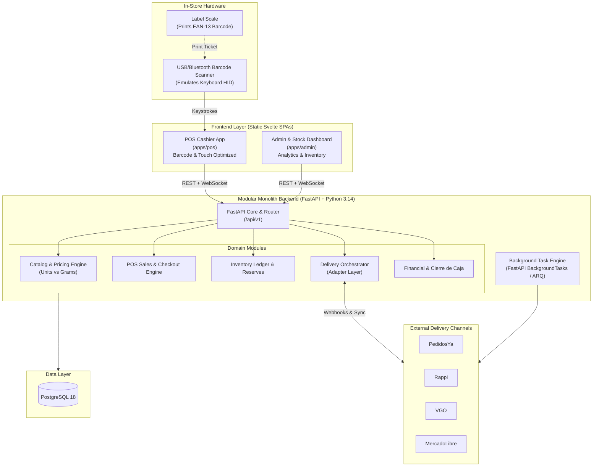
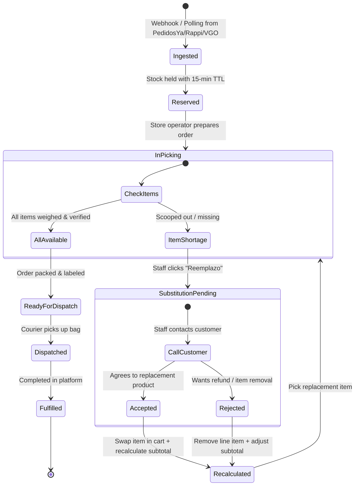

# Vitalcer — System Architecture & Technical Specification

**Project:** Vitalcer Dietetic Store Management System (Single Store)  
**Version:** 1.0.0  
**Author:** Brian & Antigravity  
**Status:** Approved Architecture Draft  

---

## 1. Executive Summary & Goals

Vitalcer is an independent dietetic store (*dietética*) selling both **discrete unit goods** (e.g., packaged cookies, supplements, bottled beverages) and **continuous bulk goods** (e.g., nuts, seeds, flours, dried fruit sold by weight).

The business operates a physical storefront while simultaneously fulfilling online delivery orders across multiple external channels (**PedidosYa, Rappi, VGO, MercadoLibre**).

### Primary Challenges
1. **Hybrid Catalog & Pricing**: Supporting discrete products (units) and continuous bulk products (grams), with price tiers (e.g., per 100g, per 1kg).
2. **Barcode Scale Scanning**: Translating EAN-13 embedded-weight barcodes generated by in-store scales directly at the POS checkout without manual cashier entry or fragile hardware driver cables.
3. **Physical vs. Digital Concurrency**: Preventing overselling when in-store customers and online delivery orders compete for the same physical bin on the shelf.
4. **Substitution & Edge Cases**: Handling out-of-stock events, product replacements (*reemplazos*), and subtotal recalculation for in-progress delivery orders.
5. **Inventory Drift (Merma)**: Bulk goods naturally lose weight (evaporation, spills, scale tolerance), requiring an audit-proof ledger and straightforward reconciliation workflows.

---

## 2. High-Level System Architecture

Rather than building distributed microservices—which introduce distributed transactions, split-brain inventory, and excessive operational overhead for a single store—the system is designed as a **Modular Monolith** backend paired with **decoupled static frontend applications**.



### Key Architectural Decisions

| Decision | Choice | Rationale |
| :--- | :--- | :--- |
| **Architecture Pattern** | **Modular Monolith** | Avoids network partition bugs, distributed lock managers, and Docker sprawl while maintaining strict module isolation. |
| **Backend Framework** | **FastAPI + SQLModel** | Combines SQLAlchemy 2.0 and Pydantic v2 into single definitions, eliminating model-schema redundancy. |
| **Rapid API Prototyping**| **FastCRUD** | Generates zero-boilerplate CRUD endpoints for standard entities while reserving custom services for transactional logic (checkout, sync). |
| **Client Code Generation**| **`@hey-api/openapi-ts`** | Automatically generates strongly typed TypeScript API clients for Svelte from the FastAPI `/openapi.json` contract. |
| **Frontend Framework** | **Svelte (SPA)** | Ultra-fast reactivity, zero runtime virtual DOM overhead, excellent keyboard event interception for barcode scanners. |
| **Database** | **PostgreSQL 18** | ACID compliance, row-level locking (`SELECT FOR UPDATE`), JSONB for channel-specific payloads, robust transactions. |

---

## 3. Product & Inventory Modeling

### 3.1 Base Measurement Units

To eliminate floating-point rounding errors and unit mismatches, all items are stored in **canonical base units**:

*   **Bulk Products (`is_bulk = true`)**: Canonical unit is **grams (`g`)**. Stock quantity is an integer representing total grams.
*   **Discrete Products (`is_bulk = false`)**: Canonical unit is **individual items (`unit`)**. Stock quantity is an integer representing packaging count.
*   **Currency**: Prices are stored as **integer cents/centavos** (e.g., $1500.50 ARS = `150050`).

### 3.2 Product Schema Definition (SQLModel)

```python
from enum import Enum
from typing import Optional
from sqlmodel import SQLModel, Field
from datetime import datetime

class ProductType(str, Enum):
    DISCRETE = "discrete"   # Sold by unit (box of cookies, tea)
    BULK = "bulk"           # Sold by weight (almonds, chia seeds)

class Product(SQLModel, table=True):
    __tablename__ = "products"

    id: Optional[int] = Field(default=None, primary_key=True)
    sku: str = Field(unique=True, index=True)          # E.g. "COOKIE-OREO-120G" or "NUT-ALMOND-PEL"
    plu_code: Optional[str] = Field(default=None, index=True) # 4-digit scale code, e.g. "0142"
    name: str = Field(index=True)
    product_type: ProductType = Field(default=ProductType.DISCRETE)
    
    # Pricing (stored in integer cents)
    # If discrete: price per single unit
    # If bulk: price per reference weight (e.g. 100 grams)
    unit_price_cents: int
    bulk_reference_grams: int = Field(default=100)    # Usually 100g in dietéticas
    
    # Inventory state (current calculated balance)
    current_stock: int = Field(default=0)             # Units or Grams
    reserved_stock: int = Field(default=0)            # Held by pending delivery orders
    min_safety_buffer: int = Field(default=0)         # Buffer to withhold from delivery sync
    
    # External Channel Flags
    is_active: bool = Field(default=True)
    sync_pedidosya: bool = Field(default=True)
    sync_rappi: bool = Field(default=True)
    sync_vgo: bool = Field(default=True)
    sync_mercadolibre: bool = Field(default=False)
    
    created_at: datetime = Field(default_factory=datetime.utcnow)
    updated_at: datetime = Field(default_factory=datetime.utcnow)
```

### 3.3 The Double-Entry Inventory Ledger

Stock is **never** directly overwritten with an `UPDATE products SET current_stock = 50`. Every inventory change is an append-only ledger transaction, preserving a complete audit trail:

```python
class InventoryMovementType(str, Enum):
    SALE_POS = "sale_pos"                     # In-store checkout
    DELIVERY_FULFILLED = "delivery_fulfilled" # Delivery picked and dispatched
    SUPPLIER_RECEIVING = "receiving"          # Stock replenishment
    SHRINKAGE_MERMA = "shrinkage_merma"       # Spills, moisture loss, discard
    MANUAL_ADJUSTMENT = "manual_adjustment"   # Physical audit reconciliation

class InventoryLedger(SQLModel, table=True):
    __tablename__ = "inventory_ledger"

    id: Optional[int] = Field(default=None, primary_key=True)
    product_id: int = Field(foreign_key="products.id", index=True)
    movement_type: InventoryMovementType
    quantity_delta: int                       # Negative for sales/merma, positive for receiving
    balance_after: int                        # Running balance at moment of transaction
    reference_id: Optional[str] = Field(default=None) # E.g., POS ticket #, Delivery order #
    notes: Optional[str] = None
    created_at: datetime = Field(default_factory=datetime.utcnow)
```

---

## 4. Hardware & In-Store Barcode Parsing (EAN-13)

Dietetic stores use commercial label printing scales (e.g., Systel, Kretz, Toledo, Digi). When weighing bulk goods, the scale prints a standard **GS1 In-Store EAN-13 Embedded Barcode**.

### 4.1 Barcode Structure

```
Format: PP IIII WWWWW C
Example: 20 0142 00350 7
         │  │    │     └─ Check Digit (Modulo 10)
         │  │    └─────── Weight: 00350 = 350 grams (or 0.350 kg)
         │  └──────────── PLU / Product Code: 0142 (Raw Almonds)
         └─────────────── In-store Prefix: 20 (Configurable: 20, 21, 28, 29)
```

### 4.2 Svelte POS Parser Implementation

The USB/Bluetooth barcode scanner acts as a standard **Keyboard Human Interface Device (HID)**. When scanned, it injects characters rapidly followed by an `Enter` key event.

```typescript
// apps/pos/src/lib/barcode/ean13Parser.ts

export interface ParsedBarcode {
  isEmbeddedWeight: boolean;
  rawBarcode: string;
  skuOrPlu: string;
  weightGrams?: number;
}

export function parseBarcode(raw: string): ParsedBarcode {
  const clean = raw.trim();

  // Validate 13 digits
  if (/^\d{13}$/.test(clean)) {
    const prefix = clean.substring(0, 2);
    
    // In-store prefix list (typical Argentine & international retail standards)
    if (['20', '21', '28', '29'].includes(prefix)) {
      const plu = clean.substring(2, 6);       // 4-digit PLU
      const weightRaw = clean.substring(6, 11); // 5-digit weight in grams
      const weightGrams = parseInt(weightRaw, 10);

      return {
        isEmbeddedWeight: true,
        rawBarcode: clean,
        skuOrPlu: plu,
        weightGrams: weightGrams,
      };
    }
  }

  // Standard discrete barcode (e.g. 779... cookies)
  return {
    isEmbeddedWeight: false,
    rawBarcode: clean,
    skuOrPlu: clean,
  };
}
```

**POS Action Flow:**
1. Scanner triggers keystrokes into POS window.
2. POS intercepts `Enter`, passes raw string to `parseBarcode()`.
3. If `isEmbeddedWeight == true`:
   - Looks up product by `plu_code == "0142"`.
   - Computes line total: `(unit_price_cents / bulk_reference_grams) * weightGrams`.
   - Adds line item: `Raw Almonds - 350g @ $1,500/100g = $5,250`.
4. If `isEmbeddedWeight == false`:
   - Looks up product by `sku`.
   - Adds 1 discrete unit to cart.

---

## 5. Concurrency & The "Last Bag of Nuts" Problem

### 5.1 Physical Reality vs. Online Orders
*   **Rule of Physical Priority**: An in-store customer standing in front of the cashier with physical items *always takes precedence* over an unpicked delivery order.
*   **The Problem**: At 14:02, counter customer scoops 1,000g of almonds (the last bin). At 14:02:15, a PedidosYa order arrives requesting 1,000g of almonds.

### 5.2 Prevention: Virtual Stock Buffering

External delivery platforms **never see 100% of real stock**. The system calculates **Virtual Stock** published to APIs:

$$\text{Virtual Stock} = \max(0, \text{Current Stock} - \text{Reserved Stock} - \text{Safety Buffer})$$

*Example:*
* Physical stock in bin: `1,200g`
* Safety buffer: `500g`
* Published to PedidosYa/Rappi: `700g` (The platform will reject orders exceeding 700g, safeguarding in-store inventory).
* If stock drops below `Safety Buffer`, the sync worker immediately sends an API call: **`PAUSE_ITEM`** / **`OUT_OF_STOCK`**.

### 5.3 Order Lifecycle & Substitution State Machine

When an online delivery order requests an item that is physically unavailable or depleted:



### 5.4 Handling Substitutions in the System
1. **Operator Alert**: The POS/Admin sounds an audible alarm and flashes `CONFLICT: Order #1042 Almonds 1000g unavailable`.
2. **One-Click Suggestion Engine**:
   - The UI displays related items in stock (e.g., *Walnuts*, *Smoked Almonds*, *Cashews*).
3. **Difference Calculation**:
   - Original: `1000g Almonds = $12,000`
   - Replacement: `1000g Cashews = $14,500` (Difference: `+$2,500`)
4. **Platform Action**:
   - For **PedidosYa / Rappi**: The backend calls the platform's order modification endpoint (`POST /orders/{id}/items/replace` or adjust order API) or prompts the cashier for payment adjustment per platform rules.
   - The Inventory Ledger releases the reservation on `Almonds` and reserves `1000g Cashews`.

---

## 6. Multi-Platform Delivery Synchronizer

### 6.1 Unified Adapter Interface

Each delivery provider has unique quirks, auth protocols, and rate limits. The system uses a **Plugin / Adapter Pattern** with a unified contract:

```python
from abc import ABC, abstractmethod
from typing import List
from pydantic import BaseModel

class StandardOrder(BaseModel):
    platform: str                    # "pedidosya" | "rappi" | "vgo" | "mercadolibre"
    platform_order_id: str
    customer_name: str
    customer_phone: Optional[str]
    items: List[StandardOrderItem]
    total_cents: int
    status: str

class DeliveryAdapter(ABC):
    @abstractmethod
    async def update_catalog_stock(self, product_id: int, virtual_stock: int) -> bool:
        """Publishes available virtual stock or pauses product."""
        pass

    @abstractmethod
    async def pause_product(self, product_id: int) -> bool:
        """Instantly marks product as unavailable on platform."""
        pass

    @abstractmethod
    async def ingest_order(self, raw_payload: dict) -> StandardOrder:
        """Parses platform-specific webhook/order payload into canonical model."""
        pass

    @abstractmethod
    async def modify_order_item(self, platform_order_id: str, old_item_id: str, new_item_id: str, new_qty: int) -> bool:
        """Communicates replacement/substitution to platform."""
        pass
```

### 6.2 Platform Profiles & Specifics

| Platform | Ingestion Method | Stock Sync Protocol | Substitution Capability | Notes |
| :--- | :--- | :--- | :--- | :--- |
| **PedidosYa** | Inbound Webhooks | Menu / Catalog API (Batch or Item PUT) | Supported via Partner API | High volume, strict dispatch timers. |
| **Rappi** | Inbound Webhooks + Polling fallback | Catalog Stock Sync API | Supported via Rappi Merchant API | Requires immediate acoustic notifications in POS. |
| **VGO** | Webhook or Polling (every 30s) | REST Inventory Endpoint | Manual phone confirmation + order PATCH | Local delivery platform; simpler API surface. |
| **MercadoLibre**| Notifications Webhook (`/orders/v1`) | Items API (`PUT /items/{id}`) | Cancellation or message resolution | Lower velocity than food apps, but severe penalties for stockout cancellations. |

---

## 7. Frontend Applications (Monorepo Workspace)

The frontend is housed under `apps/` in the monorepo, managed via **pnpm**:

```
apps/
├── pos/                       # Cashier checkout application
│   ├── src/
│   │   ├── lib/
│   │   │   ├── barcode/       # EAN-13 parser & keyboard listeners
│   │   │   ├── api/           # Auto-generated API client (@hey-api/openapi-ts)
│   │   │   └── components/    # Cart, scale input, quick PLU grid, cash drawer
│   │   └── routes/
└── admin/                     # Backoffice & operations dashboard
    ├── src/
    │   ├── lib/
    │   │   ├── api/           # Auto-generated API client
    │   │   └── components/    # Catalog editor, delivery monitor, reports
    │   └── routes/
    │       ├── inventory/     # Stock reception & merma reconciliation
    │       ├── deliveries/    # Live order picking & replacement dashboard
    │       └── reports/       # Daily revenue & closure (Cierre de Caja)
```

### 7.1 Auto-Generating Typed TypeScript Clients

Whenever the FastAPI backend is updated, a single command generates full TypeScript types and fetch clients for both Svelte apps:

```bash
# 1. Export OpenAPI spec from FastAPI
make openapi
# 2. Run openapi-ts in workspace
pnpm --filter @vitalcer/pos run generate-api
pnpm --filter @vitalcer/admin run generate-api
```

---

## 8. Daily Closing & Analytics ("Cierre de Caja")

Dietetic stores manage mixed cash, card, and app payouts. At the end of every business day, the Admin dashboard performs a **Cierre de Caja**:

1. **Revenue Breakdown**:
   - Total Cash in Register.
   - POS Card Terminal Totals (Transbank / Payway / MercadoPago Point).
   - Online Delivery App Totals (PedidosYa, Rappi, VGO, MercadoLibre receivables).
2. **Cash Discrepancy (Arqueo)**:
   - System Expected Cash vs. Counted Physical Cash = Discrepancy balance.
3. **Daily Merma / Waste Report**:
   - Total grams of bulk goods written off as shrinkage.
4. **Export / Archive**:
   - Generates daily summary snapshot for accounting.

---

## 9. Implementation Roadmap

### Phase 1: Foundation & Catalog Core
* [ ] Migrate database models to **SQLModel** (`products`, `inventory_ledger`, `users`).
* [ ] Configure **FastCRUD** for standard CRUD endpoints.
* [ ] Configure **`@hey-api/openapi-ts`** pipeline to `apps/pos` and `apps/admin`.
* [ ] Implement EAN-13 Embedded Weight Barcode parser utility.

### Phase 2: POS Cashier Application
* [ ] Build Svelte POS with global keyboard barcode scanner listener.
* [ ] Implement cart calculation supporting discrete units + weighted grams.
* [ ] Implement checkout flow with inventory ledger reduction.
* [ ] Test with simulated EAN-13 barcodes (`200142003507`).

### Phase 3: Inventory Engine & Merma
* [ ] Build stock receiving interface (inbound supplier orders).
* [ ] Build inventory adjustment & shrinkage (*merma*) logging modal in Admin.
* [ ] Add automated stock calculation views (`current_stock`, `reserved_stock`).

### Phase 4: Delivery Integrations & Orchestration
* [ ] Implement `DeliveryAdapter` interface.
* [ ] Build mock adapter to test incoming orders, reservations, and timeouts.
* [ ] Build Live Order Picking screen with Conflict & Substitution workflows.
* [ ] Implement concrete PedidosYa and Rappi adapters.

### Phase 5: Dashboard & Financial Closing
* [ ] Build Cierre de Caja summary screen (Cash, Cards, Delivery platforms).
* [ ] Daily sales, margin, and shrinkage reports.
