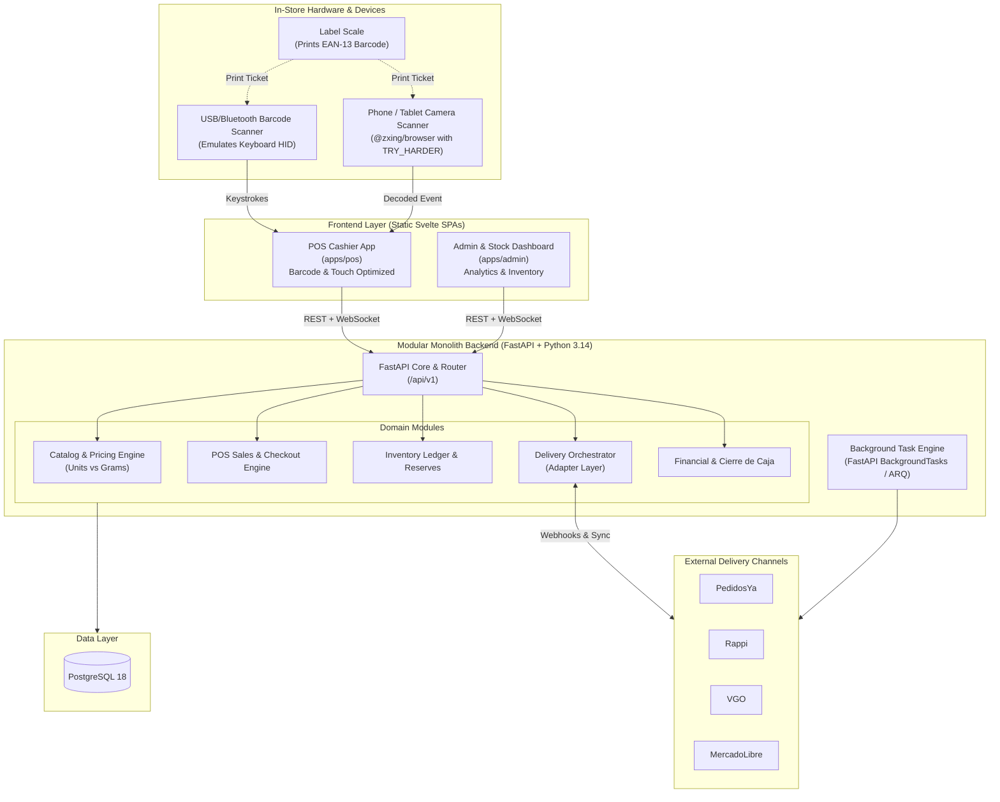
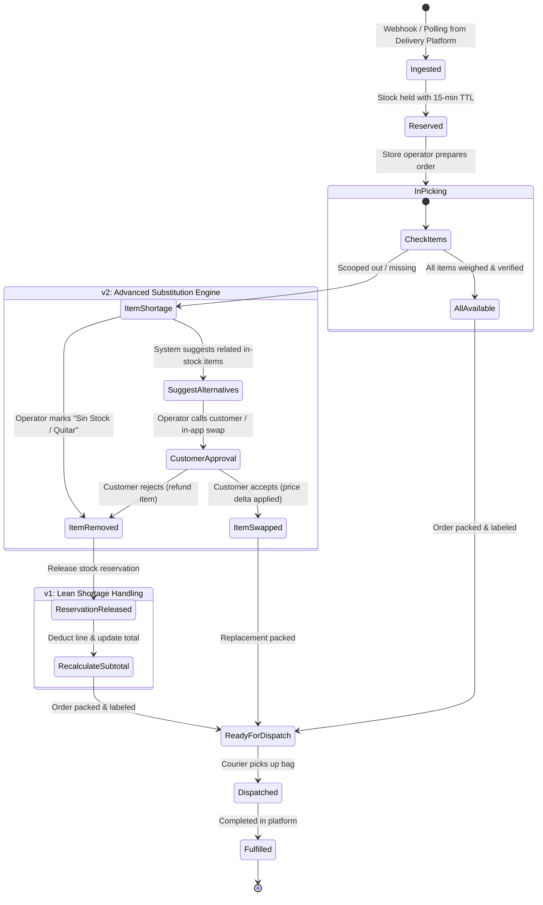

# Vitalcer — System Architecture & Technical Specification

**Project:** Vitalcer Dietetic Store Management System (Single Store)  
**Version:** 1.0.0  
**Author:** Brian & Antigravity  
**Status:** Approved Architecture Draft  

---

## 1. Executive Summary & Goals

Vitalcer is an independent dietetic store (*dietética*) selling both **discrete unit goods** (e.g., packaged cookies, supplements, bottled beverages) and **continuous bulk goods** (e.g., nuts, seeds, flours, dried fruit sold by weight).

The business operates a physical storefront while simultaneously fulfilling online delivery orders across multiple external channels (**PedidosYa, Rappi, VGO, MercadoLibre**).

### Primary Challenges

1. **Hybrid Catalog & Pricing**: Supporting discrete products (units) and continuous bulk products (grams), with price tiers (e.g., per 100g, per 1kg).
2. **Barcode Scale Scanning**: Translating EAN-13 embedded-weight barcodes generated by in-store scales directly at the POS checkout without manual cashier entry or fragile hardware driver cables.
3. **Physical vs. Digital Concurrency**: Preventing overselling when in-store customers and online delivery orders compete for the same physical bin on the shelf.
4. **Substitution & Edge Cases**: Handling out-of-stock events, product replacements (*reemplazos*), and subtotal recalculation for in-progress delivery orders.
5. **Inventory Drift (Merma)**: Bulk goods naturally lose weight (evaporation, spills, scale tolerance), requiring an audit-proof ledger and straightforward reconciliation workflows.

---

## 2. High-Level System Architecture

Rather than building distributed microservices—which introduce distributed transactions, split-brain inventory, and excessive operational overhead for a single store—the system is designed as a **Modular Monolith** backend paired with **decoupled static frontend applications**.



### Key Architectural Decisions

| Decision | Choice | Rationale |
| :--- | :--- | :--- |
| **Architecture Pattern** | **Modular Monolith** | Avoids network partition bugs, distributed lock managers, and Docker sprawl while maintaining strict module isolation. |
| **Backend Framework** | **FastAPI + SQLModel** | Combines SQLAlchemy 2.0 and Pydantic v2 into single definitions, eliminating model-schema redundancy. |
| **Rapid API Prototyping** | **FastCRUD** | Generates zero-boilerplate CRUD endpoints for standard entities while reserving custom services for transactional logic (checkout, sync). |
| **Client Code Gen & State** | **`@hey-api/openapi-ts` + TanStack Query + Zod** | Centralized in `packages/api`: automatically generates typed clients, `@hey-api/zod` schemas, and `@tanstack/svelte-query` options directly from FastAPI `/openapi.json`. |
| **Frontend Framework** | **Svelte 5 (Separated Static SPAs via SvelteKit)** | Two independent static SPAs (`apps/pos`, `apps/admin`) using `@sveltejs/adapter-static` (zero Node.js runtime). Built with Svelte 5 Runes, Tailwind CSS, and Bits UI / shadcn-svelte. |
| **Frontend Headless Suite** | **TanStack (Query, Table, Form, Virtual)** | Complete headless stack: Query (0ms in-memory catalog cache, live order polling), Table (admin ledgers), Form + Zod (validated inputs), Virtual (60 FPS scrolling for 5000+ SKUs). |
| **Database** | **PostgreSQL 18** | ACID compliance, row-level locking (`SELECT FOR UPDATE`), JSONB for channel-specific payloads, robust transactions. |

---

## 3. Product & Inventory Modeling

### 3.1 Base Measurement Units

To eliminate floating-point rounding errors and unit mismatches, all items are stored in **canonical base units**:

* **Bulk Products (`is_bulk = true`)**: Canonical unit is **grams (`g`)**. Stock quantity is an integer representing total grams.
* **Discrete Products (`is_bulk = false`)**: Canonical unit is **individual items (`unit`)**. Stock quantity is an integer representing packaging count.
* **Currency**: Prices are stored as **integers in whole Argentine Pesos (ARS)** (e.g., $1,500 ARS = `1500`). Cents/centavos are strictly omitted as they are obsolete in Argentine retail and commerce.

### 3.2 Product Schema Definition

The canonical definition lives in [`server/models/products.py`](server/models/products.py). High-level entity attributes and invariants:

| Field | Type | Invariant & Purpose |
| :--- | :--- | :--- |
| `id` | `int?` (PK) | Auto-incrementing primary key. |
| `sku` | `str` (Unique, Index) | Canonical alphanumeric identifier (e.g. `COOKIE-OREO-120G`, `NUT-ALMOND-PEL`). |
| `plu_code` | `str?` (Index) | 4-digit scale PLU code (e.g. `0142`) for bulk goods. |
| `name` | `str` (Index) | Human-readable product name. |
| `product_type` | `ProductType` | `DISCRETE` (sold per unit) or `BULK` (sold per gram). |
| `unit_price` | `int` | Whole ARS price per unit (discrete) or per reference weight (bulk). Strictly no centavos. |
| `bulk_reference_grams` | `int` | Reference weight (default `100`g) for bulk unit pricing. |
| `current_stock` | `int` | Snapshot of calculated current balance (units or grams). |
| `reserved_stock` | `int` | Units/grams reserved by pending online delivery orders. |
| `min_safety_buffer` | `int` | Safety buffer withheld from external delivery platform publishing. |
| `sync_*` | `bool` | Channel sync flags (`sync_pedidosya`, `sync_rappi`, `sync_vgo`, `sync_mercadolibre`). |
| `created_at` / `updated_at` | `datetime` | UTC timestamps. |

### 3.3 The Double-Entry Inventory Ledger

Stock is **never** directly overwritten with an `UPDATE products SET current_stock = 50`. Every inventory change is an append-only ledger transaction, preserving a complete audit trail.

The canonical definition lives in [`server/models/inventory_ledger.py`](server/models/inventory_ledger.py). High-level entity attributes:

| Field | Type | Invariant & Purpose |
| :--- | :--- | :--- |
| `id` | `int?` (PK) | Auto-incrementing primary key. |
| `product_id` | `int` (FK, Index) | Foreign key pointing to `products.id`. |
| `movement_type` | `InventoryMovementType` | `SALE_POS`, `DELIVERY_FULFILLED`, `SUPPLIER_RECEIVING`, `SHRINKAGE_MERMA`, `MANUAL_ADJUSTMENT`. |
| `quantity_delta` | `int` | Signed integer: negative for sales/merma/dispatches, positive for receiving/reversals. |
| `balance_after` | `int` | Audit running balance at the exact moment of transaction commit. |
| `reference_id` | `str?` | External or internal reference (POS receipt #, delivery order UUID, PO #). |
| `notes` | `str?` | Optional human-readable rationale (e.g. "Spill on shelf 2", "Arqueo adjustment"). |
| `created_at` | `datetime` | Immutable UTC transaction timestamp. |

---

## 4. Hardware & In-Store Barcode Parsing (EAN-13)

Dietetic stores use commercial label printing scales (e.g., Systel, Kretz, Toledo, Digi). When weighing bulk goods, the scale prints a standard **GS1 In-Store EAN-13 Embedded Barcode**.

### 4.1 Barcode Structure

```
Format: PP IIII WWWWW C
Example: 20 0142 00350 7
         │  │    │     └─ Check Digit (Modulo 10)
         │  │    └─────── Weight: 00350 = 350 grams (or 0.350 kg)
         │  └──────────── PLU / Product Code: 0142 (Raw Almonds)
         └─────────────── In-store Prefix: 20 (Configurable: 20, 21, 28, 29)
```

### 4.2 Svelte POS Parser Implementation

The USB/Bluetooth barcode scanner acts as a standard **Keyboard Human Interface Device (HID)**. When scanned, it injects characters rapidly followed by an `Enter` key event.

```typescript
// apps/pos/src/lib/barcode/ean13Parser.ts

export interface ParsedBarcode {
  rawBarcode: string;
  isEmbeddedScale: boolean;
  isEmbeddedPrice: boolean;
  isEmbeddedWeight: boolean;
  skuOrPlu: string;
  embeddedPriceWholeArs?: number;
  weightGrams?: number;
}

export function parseBarcode(raw: string): ParsedBarcode {
  const clean = raw.trim();

  // Validate 13 or 12 digits
  if ((clean.length === 12 || clean.length === 13) && /^\d+$/.test(clean)) {
    const prefix = clean.substring(0, 2);
    
    // In-store prefix list (typical Argentine retail standards: 20, 21, 28, 29)
    if (['20', '21', '28', '29'].includes(prefix)) {
      const plu = clean.substring(2, 6); // 4-digit PLU
      
      if (clean.length === 13) {
        // Standard Argentine scale firmware encodes Total Price in whole ARS (6 digits)
        const priceVal = parseInt(clean.substring(6, 12), 10);
        return {
          rawBarcode: clean,
          isEmbeddedScale: true,
          isEmbeddedPrice: true,
          isEmbeddedWeight: true,
          skuOrPlu: plu,
          embeddedPriceWholeArs: priceVal,
        };
      }

      const val = parseInt(clean.substring(6, 11), 10);
      return {
        rawBarcode: clean,
        isEmbeddedScale: true,
        isEmbeddedPrice: false,
        isEmbeddedWeight: true,
        skuOrPlu: plu,
        weightGrams: val,
        embeddedPriceWholeArs: val,
      };
    }
  }

  // Standard discrete barcode (e.g. 779... cookies)
  return {
    rawBarcode: clean,
    isEmbeddedScale: false,
    isEmbeddedPrice: false,
    isEmbeddedWeight: false,
    skuOrPlu: clean,
  };
}
```

**POS Action Flow:**

1. Scanner triggers keystrokes or camera scans barcode.
2. Intercepts code, passes raw string to `parseBarcode()`.
3. If `isEmbeddedPrice == true`:
   * Looks up bulk product by `plu_code == "2126"`.
   * Line total charged is the exact embedded price: e.g. `$14,400 ARS`.
   * Reverse-calculates physical weight: `Math.round((price / unit_price) * bulk_reference_grams) = 500g`.
   * Adds line item: `Nuez - 500g @ $2.880/100g = $14.400`.
   * Checkout ledger deducts exact physical weight: `-500g`.
4. If `isEmbeddedWeight == false`:
   * Looks up product by `sku`.
   * Adds 1 discrete unit to cart.

### 4.3 Phone & Tablet Camera Scanning (Native BarcodeDetector + ZXing Fallback)

The POS cashier application (`apps/pos`) is designed primarily as a **phone-first mobile web app**, allowing staff to scan barcodes directly using the phone or tablet camera without requiring a physical USB/Bluetooth handheld scanner:

* **Dual Detection Engine**:
  * **Native GPU Accelerated**: Uses the browser's hardware-accelerated `BarcodeDetector` API when available for ultra-fast, zero-overhead decoding.
  * **Universal Fallback**: Automatically falls back to `@zxing/browser` (`BrowserMultiFormatReader`) for browsers without native support.
* **Scan Throttling & Feedback**: Throttles duplicate reads within 1.5s to prevent double-charging, triggering an immediate emerald visual flash and Web Audio synthesizer confirmation beep.
* **Supported Formats**: `EAN_13`, `EAN_8`, `CODE_128`, `CODE_39`, `UPC_A`, `UPC_E`, `QR_CODE`.
* **Hardware & Stream Handling**:
  * Direct video feed using `navigator.mediaDevices.getUserMedia({ video: { facingMode: 'environment', width: { ideal: 1280 }, height: { ideal: 720 } } })`.
  * **HTTPS Mandatory**: Served over HTTPS (`@vitejs/plugin-basic-ssl` on port `5174`) to satisfy the W3C Secure Context requirement for camera permissions over local network / WireGuard VPN.
  * Built-in torch control (flashlight) and camera switching (rear/front).

---

## 5. Concurrency & The "Last Bag of Nuts" Problem

### 5.1 Physical Reality vs. Online Orders

* **Rule of Physical Priority**: An in-store customer standing in front of the cashier with physical items *always takes precedence* over an unpicked delivery order.
* **The Problem**: At 14:02, counter customer scoops 1,000g of almonds (the last bin). At 14:02:15, a PedidosYa order arrives requesting 1,000g of almonds.

### 5.2 Prevention: Virtual Stock Buffering

External delivery platforms **never see 100% of real stock**. The system calculates **Virtual Stock** published to APIs:

$$\text{Virtual Stock} = \max(0, \text{Current Stock} - \text{Reserved Stock} - \text{Safety Buffer})$$

*Example:*

* Physical stock in bin: `1,200g`
* Safety buffer: `500g`
* Published to PedidosYa/Rappi: `700g` (The platform will reject orders exceeding 700g, safeguarding in-store inventory).
* If stock drops below `Safety Buffer`, the sync worker immediately sends an API call: **`PAUSE_ITEM`** / **`OUT_OF_STOCK`**.

### 5.3 Order Lifecycle & Shortage State Machine

When an online delivery order requests an item that is physically unavailable or depleted:



### 5.4 Handling Item Shortages & Substitutions (Staged Implementation)

To avoid excessive upfront complexity and prevent blocked orders during store rush hours, item shortages are tackled in two evolutionary stages:

#### Stage 1: v1 Out-of-Stock / Removal Switch (Phase 4A Core)
1. **Operator Shortage Action**: When weighing or bagging an item that is depleted, the operator clicks **"Sin Stock / Quitar"** directly on the picking checklist item.
2. **Immediate Ledger Release**: The backend immediately calls `release_stock(...)` to cancel the virtual reservation on that product, freeing up ledger balance and adjusting current stock accounting.
3. **Automatic Subtotal Deduction**: The order line is marked as `removed`, and the order total is automatically reduced.
4. **Immediate Catalog Auto-Pause**: The system marks the product as out of stock and triggers `pause_product(...)` via the adapter to prevent subsequent online orders.

#### Stage 2: v2 Advanced Substitution Engine (Phase 4B Post-Launch)
1. **Operator Alert**: Visual conflict notification and audible tone for missing bulk or unit goods.
2. **One-Click Suggestion Engine**: UI suggests related in-stock items (e.g., *Cashews* replacing *Almonds*).
3. **Price Delta Calculation**:
   * Original: `1000g Almonds = $12,000 ARS`
   * Replacement: `1000g Cashews = $14,500 ARS` (Difference: `+$2,500 ARS`)
4. **Platform & Ledger Swap**: Calls platform-specific order modification API (`POST /orders/{id}/items/replace`), releases reservation on the original SKU, and reserves the replacement SKU in `InventoryLedger`.

---

## 6. Multi-Platform Delivery Synchronizer

### 6.1 Unified Adapter Interface

Each delivery provider has unique quirks, auth protocols, and rate limits. The system uses a **Plugin / Adapter Pattern** with a unified contract:

```python
from abc import ABC, abstractmethod
from typing import List
from pydantic import BaseModel


class StandardOrder(BaseModel):
    platform: str  # "pedidosya" | "rappi" | "vgo" | "mercadolibre"
    platform_order_id: str
    customer_name: str
    customer_phone: Optional[str]
    items: List[StandardOrderItem]
    total_amount: int  # In whole ARS ($)
    status: str


class DeliveryAdapter(ABC):
    @abstractmethod
    async def update_catalog_stock(self, product_id: int, virtual_stock: int) -> bool:
        """Publishes available virtual stock or pauses product."""
        pass

    @abstractmethod
    async def pause_product(self, product_id: int) -> bool:
        """Instantly marks product as unavailable on platform."""
        pass

    @abstractmethod
    async def ingest_order(self, raw_payload: dict) -> StandardOrder:
        """Parses platform-specific webhook/order payload into canonical model."""
        pass

    @abstractmethod
    async def remove_order_item(self, platform_order_id: str, item_id: str) -> bool:
        """Notifies platform of an out-of-stock item removal (v1 lean flow)."""
        pass

    async def modify_order_item(
        self, platform_order_id: str, old_item_id: str, new_item_id: str, new_qty: int
    ) -> bool:
        """Communicates replacement/substitution to platform (v2 advanced flow)."""
        raise NotImplementedError("Advanced substitution will be enabled in v2")
```

### 6.2 Platform Profiles & Specifics

> **Bureaucracy & API Onboarding Strategy**:
> Obtaining official API credentials, merchant partner keys, and production webhook whitelisting from delivery providers (PedidosYa, Rappi, etc.) involves significant legal and administrative lead time.
> Therefore, **Phase 4A** builds and fully tests the internal orchestration against a fully compliant **Mock Delivery Adapter**.
> Once credentials are approved, **Phase 4B** rolls out concrete adapters **one platform at a time**, starting with the provider the business has direct, immediate account access for.

| Platform | Ingestion Method | Stock Sync Protocol | Shortage & Substitution Capability | Notes |
| :--- | :--- | :--- | :--- | :--- |
| **Mock Adapter** | Local test runner / Webhook simulator | In-memory stock state | v1 Item Removal + v2 Swapping | Phase 4A development & automated integration tests. |
| **PedidosYa** | Inbound Webhooks | Menu / Catalog API (Batch or Item PUT) | Supported via Partner API | High volume, strict dispatch timers. Primary food partner candidate. |
| **Rappi** | Inbound Webhooks + Polling fallback | Catalog Stock Sync API | Supported via Rappi Merchant API | Requires immediate acoustic notifications in POS. |
| **VGO** | Webhook or Polling (every 30s) | REST Inventory Endpoint | Manual phone confirmation + order PATCH | Local delivery platform; simpler API surface. |
| **MercadoLibre** | Notifications Webhook (`/orders/v1`) | Items API (`PUT /items/{id}`) | Cancellation or message resolution | Lower velocity than food apps, but severe penalties for stockout cancellations. |

---

## 7. Frontend Applications & Workspace Architecture

The frontend is structured as a **pnpm monorepo workspace** separating user interfaces by operational context while sharing data access, UI primitives, and business logic.

### 7.1 Monorepo Workspace Structure

```
├── apps/
│   ├── pos/                   # Cashier checkout application (Static SvelteKit SPA)
│   │   ├── src/
│   │   │   ├── lib/
│   │   │   │   ├── barcode/   # Global scanner listener & HID event trap
│   │   │   │   ├── cart/      # Transactional cart state machine (Svelte 5 Runes)
│   │   │   │   └── audio/     # Scanner feedback beeps & error buzzers
│   │   │   └── routes/        # / (Main register), /numpad, /history
│   └── admin/                 # Backoffice & operations dashboard (Static SvelteKit SPA)
│       ├── src/
│       │   ├── lib/
│       │   │   ├── picking/   # Live order picking & conflict resolution
│       │   │   └── reports/   # Cierre de caja calculations
│       │   └── routes/
│       │       ├── catalog/   # Product table & price tiers
│       │       ├── inventory/ # Stock receiving & merma modal
│       │       ├── deliveries/# Live multi-platform dispatch queue
│       │       └── closure/   # Daily financial close & arqueo
├── packages/
│   ├── api/                   # Centralized @hey-api client, Zod schemas, TanStack Query options
│   ├── ui/                    # Shared Tailwind CSS, Bits UI / shadcn-svelte primitives (Button, Input, Dialog, etc.)
│   └── core/                  # EAN-13 barcode parser, ARS currency & weight formatters
```

### 7.2 Core Architectural Principles

1. **Separated Static SPAs (`apps/pos` & `apps/admin`)**:
   * Both applications are independent SvelteKit projects configured with `@sveltejs/adapter-static` in pure SPA mode (`ssr = false` in root `+layout.ts`, with `fallback: 'index.html'`).
   * **Zero Node.js Runtime in Production**: Built into pure static HTML/CSS/JS bundles served directly by Caddy. Eliminates SSR hydration delays, server memory leaks, and Node container management.
   * **Network-Fault Tolerance**: Once loaded in the browser, in-store cashier operations are resilient to momentary local Wi-Fi drops; local client-side state is completely preserved.
   * **Independent Deployment & Isolation**: Changes or updates to backoffice reports do not impact or require redeploying the cashier counter app.

2. **UI & Styling Stack**:
   * **Svelte 5**: Built with modern Runes (`$state`, `$derived`, `$props`, `$effect`) for fine-grained reactivity.
   * **Tailwind CSS v4**: Utility-first styling across all apps and packages.
   * **Bits UI / shadcn-svelte**: Accessible, headless UI component primitives (Dialogs, Dropdowns, Command Palettes, Popovers, Badges, Tabs).
   * **Lucide Svelte**: Consistent iconography for retail, scales, and inventory.

### 7.3 TanStack Technologies Integration

The frontend utilizes the full TanStack suite across four critical roles:

| TanStack Tool | Primary Domain | Practical Application in Vitalcer |
| :--- | :--- | :--- |
| **`@tanstack/svelte-query`** | POS & Admin | **In-memory catalog cache** for 0ms scanner response; **declarative live polling** (`refetchInterval: 10000`) for PedidosYa/Rappi orders; **cache invalidation** on checkout. |
| **`@tanstack/svelte-table`** | Admin | Headless sorting, multi-column filtering, column visibility, and pagination for the **Inventory Ledger**, **Product Catalog**, and **Cierre de Caja** reports. |
| **`@tanstack/svelte-form`** | Admin & POS Modals | Type-safe form management integrated with generated **Zod** schemas for **Product creation/editing**, **Supplier inbound receiving**, and **Manual Merma logging**. |
| **`@tanstack/svelte-virtual`** | POS & Admin | **Virtual scrolling (60 FPS)** rendering only visible viewport items for catalogs with 1,000–5,000+ SKUs/bins, preventing DOM bloat and scanner latency. |

### 7.4 End-to-End Type Safety & Data Fetching (TanStack Query + Zod + Hey API)

To achieve complete end-to-end type safety, runtime contract validation, and robust reactive state management, the frontend client generation pipeline is centralized in `packages/api` using **`@hey-api/openapi-ts`** paired with its official plugins for **TanStack Query** (`@tanstack/svelte-query`) and **Zod** (`@hey-api/zod`).

Whenever FastAPI models or endpoints change, a single script exports the OpenAPI contract and regenerates:

1. **TypeScript Definitions** (`@hey-api/typescript`): Exact types and enums mirroring backend SQLModel/Pydantic models.
2. **Runtime Zod Schemas** (`@hey-api/zod`): Type-safe runtime schemas used for barcode parsing, cashier input validation, and defensive API boundary checking.
3. **TanStack Query Options** (`@hey-api/tanstack-query`): Preconfigured query options (`queryOptions`), mutation functions, and query keys for `@tanstack/svelte-query`, powering caching, background polling, and optimistic updates.

#### 7.4.1 Centralized Generator Configuration (`packages/api/openapi-ts.config.ts`)

```typescript
import { defineConfig } from '@hey-api/openapi-ts';

export default defineConfig({
  client: '@hey-api/client-fetch',
  input: '../../scripts/openapi.json',
  output: {
    path: 'src/generated',
    format: 'prettier',
  },
  plugins: [
    '@hey-api/typescript',
    '@hey-api/zod',
    {
      name: '@hey-api/tanstack-query',
    },
  ],
});
```

#### 7.4.2 Code Generation Workflow

```bash
# 1. Export OpenAPI spec from FastAPI backend
make openapi

# 2. Run openapi-ts in workspace to generate shared types, Zod schemas, and TanStack Query options
pnpm --filter @vitalcer/api run generate
```

#### 7.4.3 Practical Integration Examples

**1. Reactive Catalog Fetching & In-Memory Cache (POS):**

```svelte
<!-- apps/pos/src/routes/+page.svelte -->
<script lang="ts">
  import { createQuery } from '@tanstack/svelte-query';
  import { listProductsOptions } from '@vitalcer/api';

  // Products are cached in memory for instant scanner barcode matching
  const productsQuery = createQuery(() => ({
    ...listProductsOptions({ query: { is_active: true } }),
    staleTime: 1000 * 60 * 10, // 10 minutes cache
    refetchOnWindowFocus: false,
  }));
</script>
```

**2. Runtime Validation of Barcodes & Forms with Zod:**

```typescript
// packages/core/src/barcode/scannerValidator.ts
import { zProductResponse } from '@vitalcer/api/zod';
import type { ProductResponse } from '@vitalcer/api/types';

export function validateScannedProduct(payload: unknown): ProductResponse {
  // Parses and strictly validates backend API response or offline cache object
  return zProductResponse.parse(payload);
}
```

**3. Live Delivery Order Polling (Admin / Delivery Monitor):**

```svelte
<!-- apps/admin/src/routes/deliveries/+page.svelte -->
<script lang="ts">
  import { createQuery, createMutation, useQueryClient } from '@tanstack/svelte-query';
  import { listOrdersOptions, updateOrderStatusMutation } from '@vitalcer/api';

  const queryClient = useQueryClient();

  // Background polling every 10 seconds for live incoming PedidosYa/Rappi orders
  const ordersQuery = createQuery(() => ({
    ...listOrdersOptions({ query: { status: 'pending' } }),
    refetchInterval: 10000,
  }));

  const updateStatus = createMutation(() => ({
    ...updateOrderStatusMutation(),
    onSuccess: () => {
      queryClient.invalidateQueries({ queryKey: ['orders'] });
    },
  }));
</script>
```

### 7.5 POS Cashier Ergonomics & Hardware Interaction

The cashier application (`apps/pos`) is designed specifically for high-speed retail checkout:

1. **Global Keyboard Barcode Scanner Listener (HID Trap)**:
   * Captures rapid keystrokes from USB/Bluetooth scanners regardless of what element currently has DOM focus.
   * Parses EAN-13 embedded weight and standard discrete barcodes locally in `0ms` against the TanStack Query in-memory catalog cache.
2. **Phone & Tablet Camera Barcode Scanner (ZXing)**:
   * Integrated viewfinder using `@zxing/browser` configured with `DecodeHintType.TRY_HARDER: true`.
   * Enables hands-on cashiering on tablets and mobile barcode scanning without specialized hardware.
3. **Keyboard-First Hotkeys**:
   * `F1` or `/`: Open product quick-search drawer (virtualized with `@tanstack/svelte-virtual`).
   * `F2`: Manual scale weight entry (for items weighed on non-barcode counter scales).
   * `F4`: Clear current cart.
   * `F9` / `Space`: Open payment modal with Cash.
   * `F10`: Open payment modal with Card / QR Mercado Pago.
   * `Escape`: Dismiss open modal / cancel prompt.
   * `+` / `-` / `Delete`: Cart line item quantity adjustment.
4. **Audio Feedback**:
   * Web Audio API synthesizer emitting a crisp 880Hz beep on valid scan and a 220Hz low buzzer tone on unknown PLU or validation error.
5. **Cart Line Item Presentation**:
   * Distinct visual differentiation between **Discrete items** (e.g., `Alfajor Choco (x2) — $3.000`) and **Continuous bulk items** (e.g., `Almendras Nonpareil (350 g @ $1.500 / 100g) — $5.250`). All subtotals and totals are formatted as integers in whole ARS.

### 7.6 Admin Backoffice & Operations

The Admin application (`apps/admin`) manages backoffice logistics, inventory, and financial control:

1. **Live Delivery Queue & Acoustic Dispatch**:
   * Declarative background polling via TanStack Query (`refetchInterval: 10000`).
   * Audible bell when new orders arrive from PedidosYa, Rappi, or VGO.
   * Visual conflict alerts when physical shelf stock is lower than requested order quantities.
2. **One-Click Substitution Drawer**:
   * Suggests available in-stock alternatives with automatic unit price difference calculation (`+$2.500 ARS`).
   * Dispatches item modification updates via platform adapters.
3. **Inventory Ledger & Merma Reconciliation**:
   * Powered by `@tanstack/svelte-table` and `@tanstack/svelte-virtual` for fast sorting and filtering across thousands of historical transactions.
   * Instant merma write-off modal updating running balances.
4. **Daily Closing ("Cierre de Caja")**:
   * Cash discrepancy calculator (system expected cash vs cashier physical count arqueo).

---

## 8. Daily Closing & Analytics ("Cierre de Caja")

Dietetic stores manage mixed cash, card, and app payouts. At the end of every business day, the Admin dashboard performs a **Cierre de Caja**:

1. **Revenue Breakdown**:
   * Total Cash in Register.
   * POS Card Terminal Totals (Transbank / Payway / MercadoPago Point).
   * Online Delivery App Totals (PedidosYa, Rappi, VGO, MercadoLibre receivables).
2. **Cash Discrepancy (Arqueo)**:
   * System Expected Cash vs. Counted Physical Cash = Discrepancy balance.
3. **Daily Merma / Waste Report**:
   * Total grams of bulk goods written off as shrinkage.
4. **Export / Archive**:
   * Generates daily summary snapshot for accounting.

---

## 9. Implementation Roadmap

### Phase 1: Foundation & Monorepo Setup

* [x] Migrate database models to **SQLModel** (`products`, `inventory_ledger`, `users`) with integer whole ARS pricing.
* [x] Configure **FastCRUD** for standard CRUD endpoints.
* [x] Implement EAN-13 Embedded Weight Barcode parser utility in backend and `@vitalcer/core`.
* [x] Scaffold pnpm monorepo packages (`packages/api`, `packages/ui`, `packages/core`).
* [x] Configure **`@hey-api/openapi-ts`** pipeline in `packages/api` with **TanStack Query** and **Zod** plugins.
* [x] Scaffold separated static SvelteKit SPAs (`apps/pos` and `apps/admin`) with Tailwind CSS v4 and Bits UI / shadcn-svelte.
* [x] Hermetic toolchain configuration via **Nix (`devenv.nix`)** and `Makefile`.

### Phase 2: POS Cashier Application (Phone-First)

* [x] Build Svelte 5 POS cashier layout optimized for mobile screens.
* [x] Integrate HTTPS support via `@vitejs/plugin-basic-ssl` on port `5174` for mobile camera permissions.
* [x] Implement Camera Barcode Scanner with native `BarcodeDetector` + `@zxing/browser` fallback, race condition guards, and torch control.
* [x] Integrate Web Audio API feedback (880Hz confirmation beep & 220Hz error buzzer).
* [x] Integrate TanStack Query in-memory catalog caching for instant 0ms scanner response.
* [x] Implement cart state machine in Svelte 5 Runes supporting discrete units + weighted grams (in whole ARS).
* [x] Implement manual scale weight modal and quick product search modal.
* [x] Implement checkout modal supporting Cash (with quick bills & change calculation), Card terminal, and QR Mercado Pago.
* [x] Atomically record sales to the backend double-entry inventory ledger (`/inventory/sale-pos`).

### Phase 3: Inventory Engine & Merma

* [x] Automated stock calculation & double-entry ledger backend engine (`/receive`, `/merma`, `/adjust`, `/reserve`, `/release`, `/fulfill`, `/sale-pos`, `/audit`, `/ledger`).
* [x] Build stock receiving interface for inbound supplier orders (`apps/admin/src/routes/actions/+page.svelte`).
* [x] Build inventory adjustment & shrinkage (*merma*) logging interface in Admin.
* [x] Build immutable audit trail ledger table with movement type filters and pagination (`apps/admin/src/routes/ledger/+page.svelte`).
* [x] Build product catalog manager with `@tanstack/svelte-virtual` (60 FPS scrolling) and responsive mobile bottom-sheet / desktop dialog.

### Phase 4A: Delivery Core, Virtual Buffers & Live Picking (Internal & Mock Driven)

* [ ] Define `DeliveryOrder` and `DeliveryOrderItem` SQLModel tables with status lifecycle (`ingested`, `reserved`, `in_picking`, `ready_for_dispatch`, `dispatched`, `fulfilled`, `cancelled`).
* [ ] Implement `DeliveryAdapter` unified abstract interface (`update_catalog_stock`, `pause_product`, `ingest_order`, `remove_order_item`, `modify_order_item`).
* [ ] Build Mock Delivery Adapter for end-to-end webhook/order simulation & automated test fixtures.
* [ ] Implement virtual stock synchronization ($\text{Virtual Stock} = \max(0, \text{Stock} - \text{Reserved} - \text{Buffer})$) with automatic product pausing.
* [ ] Build Live Order Picking screen (`apps/admin/src/routes/deliveries`) with acoustic dispatch alerts and item checklist.
* [ ] Implement v1 Item Shortage Workflow: Simple "Sin Stock / Quitar" switch (releases reserved stock, deducts line from subtotal, updates order).
* [ ] Full automated test suite verifying order lifecycle, stock reservation release, and mock webhook ingestion.

### Phase 4B: Concrete Platform Integrations & Bureaucracy (Incremental Rollout)

* [ ] Implement concrete adapter for primary delivery partner (the platform the store has immediate credentials/access for).
* [ ] Bureaucratic integration & sandbox certification (webhook endpoint configuration, OAuth token exchange, partner rate limits).
* [ ] Incrementally add secondary platform adapters (PedidosYa, Rappi, VGO, MercadoLibre) as credentials and API access become available.
* [ ] (v2 Enhancement) Advanced Substitution Engine: alternative product suggestions, price delta calculation, and cart item swapping.

### Phase 5: Dashboard & Financial Closing ("Cierre de Caja")

* [ ] Build Daily Closing backend service aggregating Cash, Cards, and Delivery platform receivables.
* [ ] Build Cierre de Caja summary screen in Admin (`apps/admin/src/routes/closure`).
* [ ] Implement Arqueo de Caja physical cash discrepancy calculator.
* [ ] Generate daily sales, margin, and shrinkage reports.
